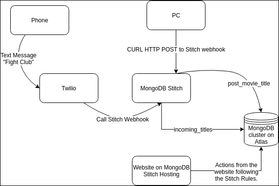
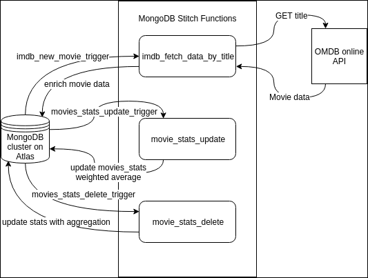
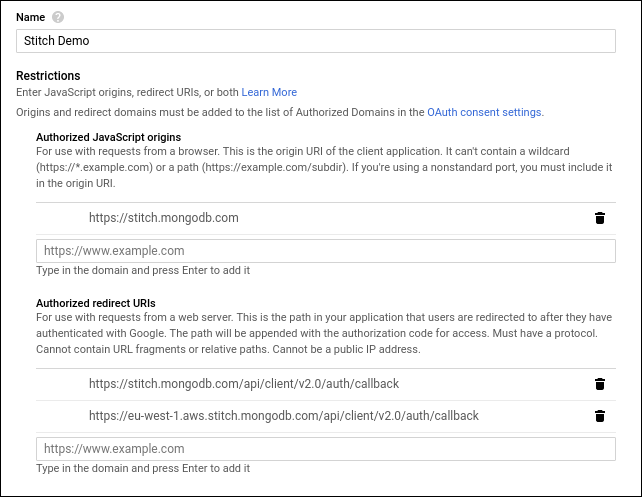

# MongoDB Stitch - Movie Collection Demo

## What is this app doing?

This application provides several ways to save a movie title into your MongoDB Atlas cluster using MongoDB Stitch. 
  - HTTP POST,
  - Twilio text message,
  - Using the Stitch Javascript SDK in a website hosted on Stitch.
  


Once we have our movie saved in our collection, a trigger is used to enrich our document automatically with data from the [OMDB API](http://www.omdbapi.com/).

Then another trigger detects the movie ratings so we calculate stats when a movie is updated or deleted.



## Deploy the Stitch App

* Create a [free cluster in MongoDB Atlas](https://docs.mongodb.com/manual/tutorial/atlas-free-tier-setup/). Save the name of it, you will need it later.
* Install [Stitch CLI](https://docs.mongodb.com/stitch/import-export/stitch-cli-reference/).
* [Setup the API key](https://docs.atlas.mongodb.com/configure-api-access/) + whitelist your IP address in Atlas.
* Add the following environment variable in your env.

```sh
export STITCH_USERNAME="<your Atlas login email>"
export STITCH_API_KEY="XXXXXXXXXXXXXXXXXXXXXXXXXXXX"
```

* **[Optional]** To make the website work,
  * Go to [Google Authentication](https://console.developers.google.com/apis/credentials),
  * Create a Google OAuth 2.0 client ID and secret (see details below).
* **[Optional]** To be able to send movie title from your phone,
  * Setup [Twilio](https://www.twilio.com/console/sms/services),
   * You will need the Twilio SID and auth token.
   * Then when the app is created, you will need to forward the text messages from Twilio to the Stitch webhook provided in the IMDB_Twilio service.
* Generate a free [API key for OMDB API](http://www.omdbapi.com/apikey.aspx). They will send you an email in which you need to click the validation link.
* Start the `1_pushToNewStitchProject.sh` script and follow the instructions. 
  * If you don't have something, just hit enter, you can fix it later in Stitch.
  * Secrets are not echoed in the shell so don't be surprised.
* Add the following environment variable in your env. You can find your APPID in the Stitch website or at the end of the previous script output.

```sh
export STITCH_APPID="myproject-abcde"
```

* You can now use the scripts 2 & 3 to work with your own new project now.
 
## Trouble with Google Credentials to make the website work?

It should look like this.



- The first authorized redirect URI is for Stitch Global deployments.
- The second one is for Stitch Local deployment in Ireland.
 

## Ideas & support

 * Please open Github tickets.
 * This is still a work in progress project so please don't judge me too much just yet :-).
